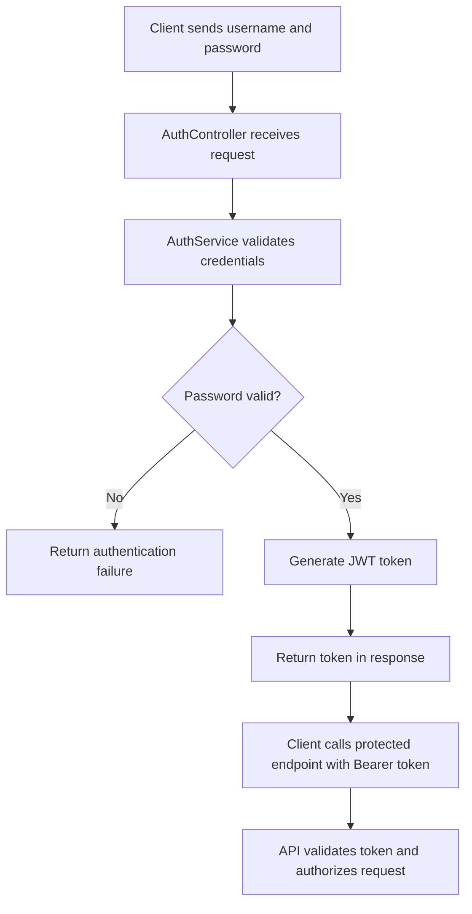
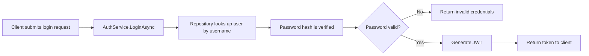
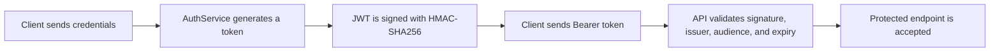
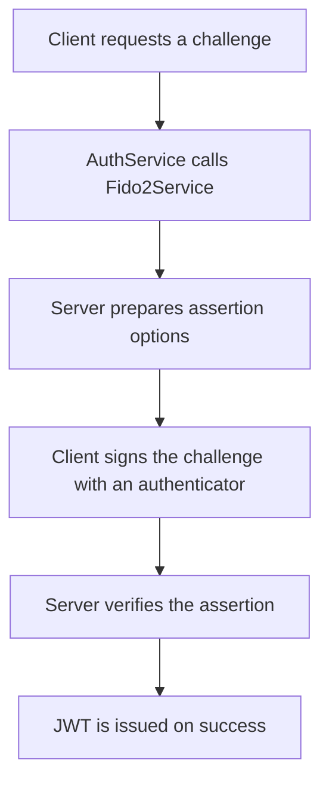

# Passwordless Authentication

This repository contains an ASP.NET Core API for authentication with two main paths:

1. Password-based login using BCrypt and JWT
2. A FIDO2/WebAuthn-style assertion flow that is scaffolded in the codebase and wired through the auth service

The current implementation is functional for password login and JWT issuance, while the FIDO2 path is present but still requires a real browser/WebAuthn integration to be fully production-ready.

## Overview

The authentication flow is built around the following sequence:



## Current API endpoints

Base route: /api/auth

| Method | Endpoint | Purpose |
|---|---|---|
| POST | /api/auth/register | Register a user with username and password. |
| POST | /api/auth/login | Validate credentials. Returns a JWT on success. |
| POST | /api/auth/fido2/challenge | Starts a FIDO2 assertion challenge flow. |
| POST | /api/auth/fido2/verify | Verifies the FIDO2 assertion and returns a JWT on success. |
| GET | /api/auth/me | Requires a valid JWT and returns the authenticated user identity. |

## Password authentication

### Password hashing

Passwords are hashed and verified with BCrypt in [PasswordlessApi/Api/Utility/PasswordHash/PasswordHash.cs](PasswordlessApi/Api/Utility/PasswordHash/PasswordHash.cs).

- Library: BCrypt.Net-Next
- Work factor: 12

### Login workflow



## JWT implementation

JWT creation and validation are handled in [PasswordlessApi/Api/Utility/Jwt/JwtHelper.cs](PasswordlessApi/Api/Utility/Jwt/JwtHelper.cs) and [PasswordlessApi/Program.cs](PasswordlessApi/Program.cs).

### JWT flow



### Current JWT behavior

- Signing algorithm: HMAC-SHA256
- Secret is loaded from JwtSettings:SecretKey or JWT_SECRET_KEY
- Token contains claims for the user ID and username
- Token lifetime is controlled by JwtSettings:ExpiryMinutes

## FIDO2 / WebAuthn status

The codebase contains a FIDO2-style authentication path, but it is not yet a complete production-ready WebAuthn implementation.

### Current FIDO2 flow



### What exists today

- Challenge and credential handling are wired through [PasswordlessApi/Api/Service/Implementation/Auth/Fido2Service.cs](PasswordlessApi/Api/Service/Implementation/Auth/Fido2Service.cs)
- The database contains challenge and credential structures in [Database/Table/AuthChallenges.sql](Database/Table/AuthChallenges.sql) and [Database/Table/UserCredentials.sql](Database/Table/UserCredentials.sql)
- Stored procedure operations exist in [Database/Procedure/Users.sql](Database/Procedure/Users.sql)

## Code implementation logic

### Controller layer

The entry points are in [PasswordlessApi/Api/Controller/Auth/AuthController.cs](PasswordlessApi/Api/Controller/Auth/AuthController.cs).

Responsibilities:

- Receive registration and login requests
- Forward requests to the auth service
- Expose the protected /api/auth/me endpoint

### Service layer

The core business logic is in [PasswordlessApi/Api/Service/Implementation/Auth/AuthService.cs](PasswordlessApi/Api/Service/Implementation/Auth/AuthService.cs).

It performs:

- Password validation during login
- Password hashing during registration
- FIDO2 challenge and verification delegation
- JWT issuance after successful authentication

### Repository layer

The persistence layer is implemented in:

- [PasswordlessApi/Api/Service/Implementation/Repository/DapperRepository.cs](PasswordlessApi/Api/Service/Implementation/Repository/DapperRepository.cs)
- [PasswordlessApi/Api/Service/Implementation/Repository/GenericRepository.cs](PasswordlessApi/Api/Service/Implementation/Repository/GenericRepository.cs)

It executes stored procedures through Dapper.

## Database schema

### Users table

Defined in [Database/Table/Users.sql](Database/Table/Users.sql).

Stores:

- Id
- Username
- PasswordHash
- CreatedAt
- UpdatedAt

### AuthChallenges table

Defined in [Database/Table/AuthChallenges.sql](Database/Table/AuthChallenges.sql).

Stores temporary challenge values for future FIDO2 flows.

### UserCredentials table

Defined in [Database/Table/UserCredentials.sql](Database/Table/UserCredentials.sql).

Stores public-key credential details for WebAuthn-style authentication.

## Stored procedure design

The monolithic `sp_Users` dispatcher has been refactored into per-concern procedures that follow the
same single-responsibility principle as the application's N-tier architecture:

- `sp_Users_Register` — [Database/Procedure/Users/Register.sql](Database/Procedure/Users/Register.sql)
- `sp_Users_Login` — [Database/Procedure/Users/Login.sql](Database/Procedure/Users/Login.sql)
- `sp_Fido_CreateChallenge`, `sp_Fido_ConsumeChallenge`, `sp_Fido_UpsertCredential`,
  `sp_Fido_GetCredential`, `sp_Fido_GetCredentialsByUserId` — [Database/Procedure/Fido/](Database/Procedure/Fido/)

A backward-compatible `sp_Users` dispatcher ([Database/Procedure/Users.sql](Database/Procedure/Users.sql))
still forwards to the dedicated procedures. Keys use `INT IDENTITY` for `Users.Id` and `UserId`
foreign keys.

## Blazor UI (Auth.UI)

`Auth.UI` is a Blazor Server test client that exercises the API over HTTP. Its data-access layer
mirrors the backend repository pattern: `HttpService` plays the role of `DapperRepository` and
`GenericHttpRepository<T>` mirrors `GenericRepository<T>`.

### Routes and pages

| Route | Page | Purpose |
|---|---|---|
| `/` | `Login.razor` | Passkey-first sign-in/registration. A prominent "Sign in with a passkey" action is the primary path; password entry is offered as a fallback, and a passkey second factor is requested when `RequiresFido2`. |
| `/fido2` | `Fido2.razor` | Dedicated FIDO2/WebAuthn sign-in experience. Surfaces biometric and security-key prompts, an `awaiting authenticator` status state, clear error/retry guidance, and a separate "Use a security key" path. |
| `/profile` | `Profile.razor` | Protected page that calls `/api/auth/me` using the stored JWT; also the entry point for registering a passkey. |

The FIDO2 UI follows WebAuthn UX best practices:

- **Passkey-first, passwordless option** — the passkey button is the primary CTA; passwords are a secondary fallback.
- **Multi-factor path** — when `RequiresFido2` is returned, the user is shown a "Verify it's you" step that completes sign-in with a passkey or security key.
- **Biometric & security-key affordances** — the authenticator prompt distinguishes platform biometrics (Face ID / fingerprint) from cross-platform security keys, using `authenticatorAttachment` hints in `webauthn.js`.
- **Clear ceremony states** — the UI communicates `requesting → awaiting authenticator → verifying → success/error`, with a spinner and plain-language instructions ("Touch your security key", "Use your fingerprint").
- **Graceful errors** — `NotAllowedError`, `SecurityError`, and unsupported-browser cases are mapped to user-friendly guidance with a retry action.

### Component architecture (code-behind pattern)

Each `.razor` file contains **markup only**; all C# logic lives in a matching partial-class
`.razor.cs` file:

- `Components/Pages/Login.razor` + `Login.razor.cs`
- `Components/Pages/Fido2.razor` + `Fido2.razor.cs`
- `Components/Pages/Profile.razor` + `Profile.razor.cs`

The client-side auth flow is coordinated by `AuthController` in
`Auth.UI/src/Manager/Controller/AuthController.cs`, backed by `IAuthManager` /
`AuthManager` ([Auth.UI/src/Manager](Auth.UI/src/Manager)). The JWT returned by the API is cached in
`ITokenStore` and attached as a Bearer token for protected calls.

## Security review

### Findings

The current implementation still has a few important security concerns that should be addressed before production use:

1. The JWT configuration previously relied on a weak fallback secret. This is now removed in the code path and replaced with a required secret.
2. JWT validation now enforces issuer, audience, signing key, and expiry checks.
3. Controller routes were previously not being mapped correctly; this is now fixed so Swagger and the API endpoints can be discovered.
4. The FIDO2 flow is not yet a fully verified WebAuthn implementation, so it should be treated as a scaffold rather than a completed secure authentication mechanism.

### Recommended next steps

- Use a long random secret in JwtSettings:SecretKey or JWT_SECRET_KEY
- Keep the database connection string secured and avoid trusted authentication in production
- Add rate limiting and login throttling
- Replace the current FIDO2 scaffold with a complete browser-based WebAuthn implementation once the frontend is ready

## Example requests

### Register

```bash
curl -X POST http://localhost:5000/api/auth/register \
  -H "Content-Type: application/json" \
  -d '{"username":"alice","password":"StrongPassword123!"}'
```

### Login

```bash
curl -X POST http://localhost:5000/api/auth/login \
  -H "Content-Type: application/json" \
  -d '{"username":"alice","password":"StrongPassword123!"}'
```

### Access a protected endpoint

```bash
curl -X GET http://localhost:5000/api/auth/me \
  -H "Authorization: Bearer <your-jwt-token>"
```
